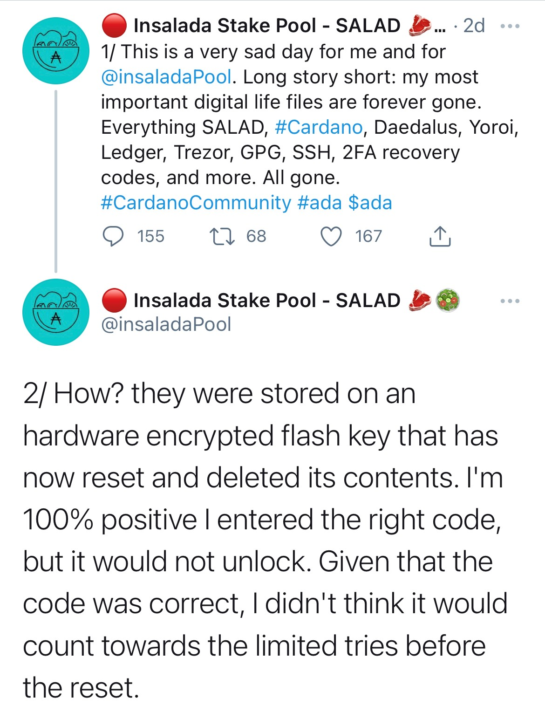
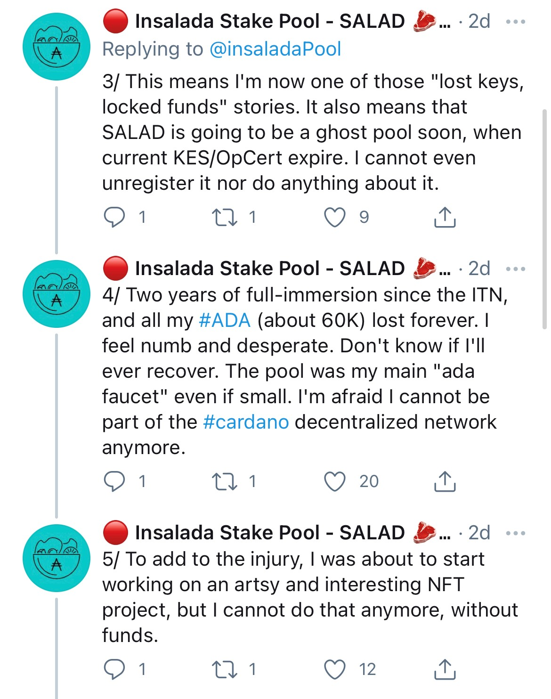

# Extra security tips for SPOs.

**Follow this first :** [https://poolguide.frcan.com/2.-harden-your-server](https://poolguide.frcan.com/2.-harden-your-server)

_`Remember, this is the minimum, you cant go wrong with doing more if you wish to.`_

**Extra tips:** 

1. Use a hardware wallet for your pledge. See my guide at: [https://poolguide.frcan.com/readme-1](https://poolguide.frcan.com/readme-1)
2. Use air-gapped machine for all transactions signing.
3. Keeping the system updated is vital before starting anything on your system. This will prevent people to use known vulnerabilities to enter in your system:

To enable ONLY security updates, do this:

```text
sudo nano /etc/apt/apt.conf.d/50unattended-upgrades
```

Edit to look like this: 

> ```text
> : Unattended-Upgrade::Allowed-Origins {
> :     "${distro_id}:${distro_codename}-security";
> : //  "${distro_id}:${distro_codename}-updates";
> : //  "${distro_id}:${distro_codename}-proposed";
> : //  "${distro_id}:${distro_codename}-backports";
> : };
> : // Unattended-Upgrade::Mail "my_user@my_domain.com";
> ```

**I took inspiration from this story from another SPO before i made this guide \(remember, this could happen to you too!\) :**






So remember to keep more than one copy of your stake pool op keys offline and only in safe places! Let this be a lesson to you!


